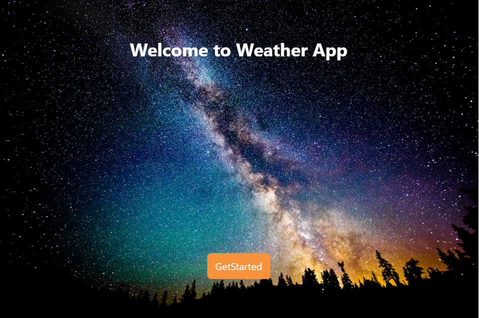
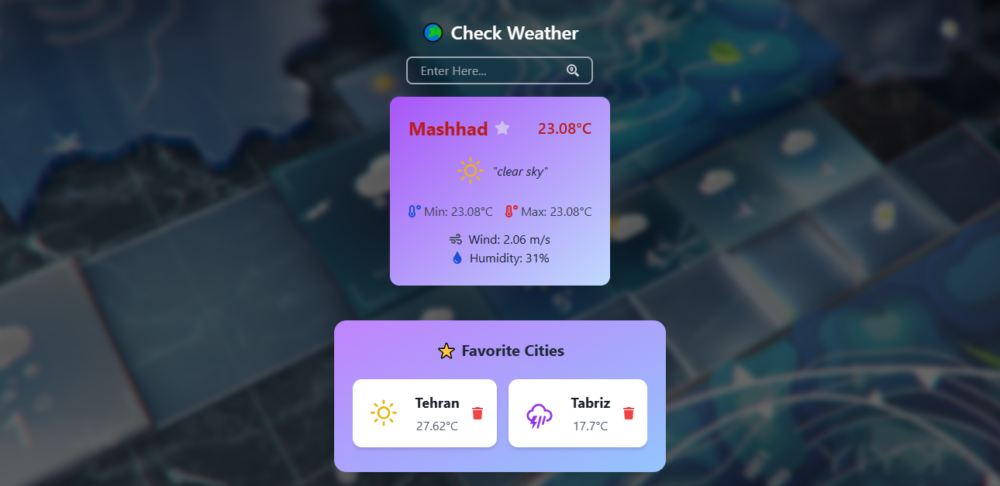

# Weather App

A modern weather application built with React, TypeScript, and Vite. This application provides real-time weather information with a beautiful and intuitive user interface.

## Features

- Real-time weather data
- Modern UI with Chakra UI and Tailwind CSS
- TypeScript for type safety
- Toast notifications for user feedback
- React Router for navigation
- Framer Motion for smooth animations

## Tech Stack

- React 19
- TypeScript
- Vite
- Chakra UI
- Tailwind CSS
- Axios for API calls
- React Router
- React Toastify
- Framer Motion
- React Icons

## ScreenShots






## Prerequisites

Before you begin, ensure you have the following installed:

- Node.js (Latest LTS version recommended)
- npm or yarn

## Installation

1. Clone the repository:

```bash
git clone https://github.com/Parisa-Esmaeilpour1993/Quiz-App
cd weather-app
```

2. Install dependencies:

```bash
npm install
# or
yarn install
```

3. Start the development server:

```bash
npm run dev
# or
yarn dev
```
